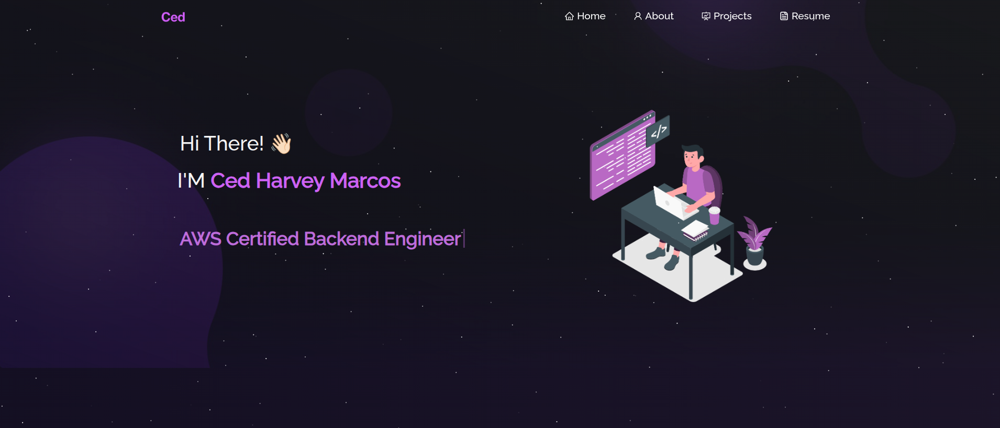

<h2 align="center">Ced's Portfolio Website 
  <a href="https://ced-portfolio.web.app/" target="_blank">ced-portfolio.web.app</a>
</h2>

  

 

## Built With

My personal portfolio <a href="https://ced-portfolio.web.app" target="_blank">ced-portfolio.web.app</a> which features some of my github projects as well as my resume and technical skills. 

This project was built using these technologies.

- React.js
- Node.js
- Express.js
- CSS3
- VSCode
- Firebase
